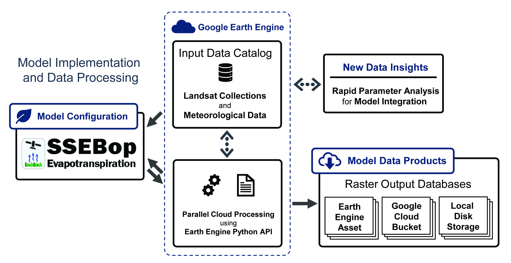
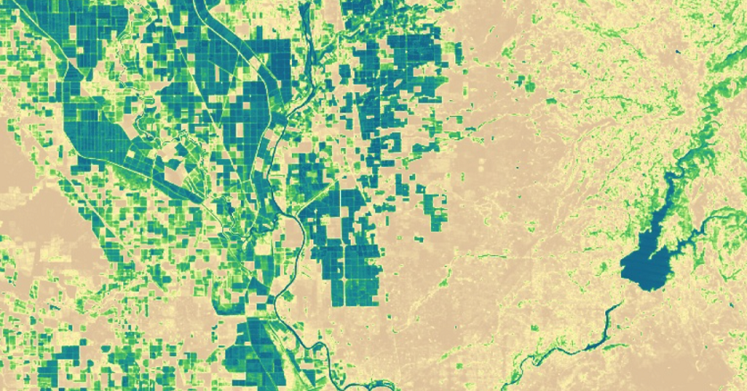

===============
OpenET - SSEBop
===============

|version| |build| |codecov|

**WARNING: This code is in development, is being provided without support, and is subject to change at any time without notification**

This repository provides `Google Earth Engine <https://earthengine.google.com/>`__ Python API based implementation of the SSEBop ET model.

The Operational Simplified Surface Energy Balance (SSEBop) model computes daily total actual evapotranspiration (ETa) using land surface temperature (Ts), maximum air temperature (Ta) and reference ET (ETr or ETo).
The SSEBop model does not solve all the energy balance terms explicitly; rather, it defines the limiting conditions based on "gray-sky" net radiation balance principles and an air temperature parameter.
This approach predefines unique sets of "hot/dry" and "cold/wet" limiting values for each pixel, allowing an operational model setup and a relatively shorter compute time.

*Basic SSEBop model implementation in Earth Engine:*

Model Design
============

The primary component of the SSEBop model is the Image() class.  The Image class can be used to compute a single fraction of reference ET (ETf) image from a single input image.  The Image class should generally be instantiated from an Earth Engine Landsat image using the collection specific methods listed below.  ET image collections can be built by computing ET in a function that is mapped over a collection of input images.  Please see the `Example Notebooks`_ for more details.

Input Collections
=================

SSEBop ET can currently be computed for Landsat Collection 2 Level 2 (SR/ST) images and Landsat Collection 1 Top-Of-Atmosphere (TOA) images from the following Earth Engine image collections:

 * LANDSAT/LC08/C02/T1_L2
 * LANDSAT/LE07/C02/T1_L2
 * LANDSAT/LT05/C02/T1_L2
 * LANDSAT/LC08/C01/T1_TOA or LANDSAT/LC08/C01/T1_RT_TOA
 * LANDSAT/LE07/C01/T1_TOA or LANDSAT/LE07/C01/T1_RT_TOA
 * LANDSAT/LT05/C01/T1_TOA

**Note:** Users are encouraged to prioritize use of Collection 2 data where available. Collection 1 will be produced by USGS until 2022-01-01, and maintained by Earth Engine until 2023-01-01. [`More Information <https://developers.google.com/earth-engine/guides/landsat#landsat-collection-status>`__]

Landsat Collection 2 SR/ST Input Image
--------------------------------------

To instantiate the class for a Landsat Collection 2 SR/ST image, use the Image.from_landsat_c2_sr method.

The input Landsat image must have the following bands and properties:

=================  ======================================
SPACECRAFT_ID      Band Names
=================  ======================================
LANDSAT_5          SR_B1, SR_B2, SR_B3, SR_B4, SR_B5, SR_B7, ST_B6, QA_PIXEL
LANDSAT_7          SR_B1, SR_B2, SR_B3, SR_B4, SR_B5, SR_B7, ST_B6, QA_PIXEL
LANDSAT_8          SR_B1, SR_B2, SR_B3, SR_B4, SR_B5, SR_B6, SR_B7, ST_B10, QA_PIXEL
=================  ======================================

Landsat Collection 1 TOA Input Image
------------------------------------

To instantiate the class for a Landsat Collection 1 TOA image, use the Image.from_landsat_c1_toa() method.

The input Landsat image must have the following bands and properties:

=================  ======================================
SPACECRAFT_ID      Band Names
=================  ======================================
LANDSAT_5          B1, B2, B3, B4, B5, B7, B6, BQA
LANDSAT_7          B1, B2, B3, B4, B5, B7, B6_VCID_1, BQA
LANDSAT_8          B2, B3, B4, B5, B6, B7, B10, BQA
=================  ======================================

=================  =============================================
Property           Description
=================  =============================================
system:index       - Landsat Scene ID
                   - Must be in the Earth Engine format (e.g. LC08_044033_20170716)
                   - Used to lookup the scene specific c-factor
system:time_start  Image datetime in milliseconds since 1970
SPACECRAFT_ID      - Used to determine which Landsat type
                   - Must be: LANDSAT_5, LANDSAT_7, or LANDSAT_8
=================  =============================================

Model Output
------------

The primary output of the SSEBop model is the fraction of reference ET (ETf).  The actual ET (ETa) can then be computed by multiplying the Landsat-based ETf image with the reference ET (e.g. ETr from GRIDMET).

*Example SSEBop ETa from Landsat:*

Example
-------

.. code-block:: python

    import openet.ssebop as ssebop

    landsat_img = ee.Image('LANDSAT/LC08/C01/T1_RT_TOA/LC08_044033_20170716')
    et_fraction = ssebop.Image.from_landsat_c1_toa(landsat_img).et_fraction
    et_reference = ee.Image('IDAHO_EPSCOR/GRIDMET/20170716').select('etr')
    et_actual = et_fraction.multiply(et_reference)

Custom Input Image
------------------

SSEBop images can also be built manually by instantiating the class with an ee.Image with the following bands: 'lst' (land surface temperature [K]) and 'ndvi' (normalized difference vegetation index).  The input image must have 'system:index' and 'system:time_start' properties (described above).

.. code-block:: python

    import openet.ssebop as ssebop

    input_img = ee.Image([ee.Image(lst), ee.Image(ndvi)]) \
        .rename(['lst', 'ndvi']) \
        .set({
            'system:index': 'LC08_044033_20170716',
            'system:time_start': ee.Date.fromYMD(2017, 7, 16).millis()})
    et_fraction = ssebop.Image(input_img).et_fraction

Example Notebooks
=================

Detailed Jupyter Notebooks of the various approaches for calling the OpenET SSEBop model are provided in the "examples" folder.

+ `Computing daily ET for a single Landsat image <examples/single_image.ipynb>`__
+ `Computing a daily ET image collection from Landsat image collection <examples/collection_overpass.ipynb>`__
+ `Computing monthly ET from a collection <examples/collection_interpolate.ipynb>`__

Ancillary Datasets
==================

Maximum Daily Air Temperature (Tmax)
------------------------------------
The daily maximum air temperature (Tmax) is essential for establishing the maximum ET limit (cold boundary) as explained in Senay2017_.
Support for source options includes CIMIS, GRIDMET, DAYMET, and other custom Image Collections. See the model Image class docstrings for more information.

Default Asset ID: *projects/usgs-ssebop/tmax/daymet_median_v2* (Daily median from 1980-2018)

Land Surface Temperature (LST)
------------------------------
Land Surface Temperature is currently calculated in the SSEBop approach two ways:

* Landsat Collection 2 Level-2 (ST band) images directly. More information can be found at: `USGS Landsat Collection 2 Level-2 Science Products <https://www.usgs.gov/core-science-systems/nli/landsat/landsat-collection-2-level-2-science-products>`__

* Landsat Collection 1 Top-of-Atmosphere images by including an on-the-fly function for calibration steps and atmospheric correction techniques. These include calculations for: (1) spectral radiance conversion to the at-sensor brightness temperature; (2) atmospheric absorption and re-emission value; and (3) surface emissivity. For additional information, users can refer to section 3.2 of the Methodology in Senay2016_.

Temperature Difference (dT)
---------------------------
The SSEBop ET model uses dT as a predefined temperature difference between Thot and Tcold for each pixel.
In SSEBop formulation, hot and cold limits are defined on the same pixel; therefore, dT actually represents the vertical temperature difference between the surface temperature of a theoretical bare/dry condition of a given pixel and the air temperature at the canopy level of the same pixel as explained in Senay2018_. The input dT is calculated under "gray-sky" conditions and assumed not to change from year to year, but is unique for each day and location.

Default Asset ID: *projects/usgs-ssebop/dt/daymet_median_v2*

Elevation
---------
The default elevation dataset is the USGS SRTM global image asset.

Default Asset ID: `USGS/SRTMGL1_003 <https://developers.google.com/earth-engine/datasets/catalog/USGS_SRTMGL1_003>`__

The elevation parameter will accept any Earth Engine image.

Temperature Correction (*c factor*)
-----------------------------------
In order to correspond the maximum air temperature with cold/wet limiting environmental conditions, the SSEBop model uses a temperature correction coefficient (*c factor*, sometimes labeled interchangeably as Tcorr) uniquely calculated for each Landsat scene from well-watered/vegetated pixels.
This temperature correction component is based on a ratio of Tmax and LST that has passed through several conditions such as NDVI limits. The SSEBop model utilizes the *c factor* as a function of the maximum air temperature, so the data source of the *c factor* collection needs to match the data source of the air temperature. **Note:** *Tcorr* refers to the pixel-based ratio of LST_cold and Tmax while *c factor* is a statistical value that represents a region such as a 5-km grid or scene-wide value.

.. image:: docs/GriddedCfactor_example.png

This parameter can be implemented dynamically as a scene-based single *c factor* (this is the default) or using precomputed spatially varying Image Assets where a gridded *c factor* is generated for every 5-km (advanced setting).

* Using either DYNAMIC or SCENE_GRIDDED settings, the *c factor* parameter is read from precomputed Earth Engine image collections based on the Landsat scene ID (from the system:index property). Monthly/annual climatology values are used if Tcorr cannot be determined for a given Landsat scene. If fallback values have not been computed for the target path/row, a default value of 0.978 will be used.
* Currently, SCENE_GRIDDED is only supported for Landsat Collection 2 across CONUS (since model version 0.1.5x) and requires a matching Tmax source. See `this example notebook <examples/tcorr_gridded.ipynb>`__ for more information.

Default Asset IDs

Scene ID: projects/usgs-ssebop/tcorr_scene/daymet_median_v2_scene

Monthly ID: projects/usgs-ssebop/tcorr_scene/daymet_median_v2_monthly

Installation
============

The OpenET SSEBop python module can be installed via pip:

.. code-block:: console

    pip install openet-ssebop

Dependencies
============

 * `earthengine-api <https://github.com/google/earthengine-api>`__
 * `openet-core <https://github.com/Open-ET/openet-core-beta>`__

OpenET Namespace Package
========================

Each OpenET model is stored in the "openet" folder (namespace).  The model can then be imported as a "dot" submodule of the main openet module.

.. code-block:: console

    import openet.ssebop as ssebop

Development and Testing
=======================

Please see the `CONTRIBUTING.rst <CONTRIBUTING.rst>`__.

References
==========

.. _references:

.. [Senay2013]
 | Senay, G., Bohms, S., Singh, R., Gowda, P., Velpuri, N., Alemu, H., Verdin, J. (2013). Operational Evapotranspiration Mapping Using Remote Sensing and Weather Datasets: A New Parameterization for the SSEB Approach. *Journal of the American Water Resources Association*, 49(3).
 | `https://doi.org/10.1111/jawr.12057 <https://doi.org/10.1111/jawr.12057>`__
.. [Senay2016]
 | Senay, G., Friedrichs, M., Singh, R., Velpui, N. (2016). Evaluating Landsat 8 evapotranspiration for water use mapping in the Colorado River Basin. *Remote Sensing of Environment*, 185.
 | `https://doi.org/10.1016/j.rse.2015.12.043 <https://doi.org/10.1016/j.rse.2015.12.043>`__
.. [Senay2017]
 | Senay, G., Schauer, M., Friedrichs, M., Manohar, V., Singh, R. (2017). Satellite-based water use dynamics using historical Landsat data (1984\-2014) in the southwestern United States. *Remote Sensing of Environment*, 202.
 | `https://doi.org/10.1016/j.rse.2017.05.005 <https://doi.org/10.1016/j.rse.2017.05.005>`__
.. [Senay2018]
 | Senay, G. (2018). Satellite Psychrometric Formulation of the Operational Simplified Surface Energy Balance (SSEBop) Model for Quantifying and Mapping Evapotranspiration. *Applied Engineering in Agriculture*, 34(3).
 | `https://doi.org/10.13031/aea.12614 <https://doi.org/10.13031/aea.12614>`__
.. [Senay2019]
 | Senay, G., Schauer, M., Velpuri, N.M., Singh, R.K., Kagone, S., Friedrichs, M., Litvak, M.E., Douglas-Mankin, K.R. (2019). Long-Term (1986–2015) Crop Water Use Characterization over the Upper Rio Grande Basin of United States and Mexico Using Landsat-Based Evapotranspiration. *Remote Sensing*, 11(13):1587.
 | `https://doi.org/10.3390/rs11131587 <https://doi.org/10.3390/rs11131587>`__
.. [Schauer2019]
 | Schauer, M.,Senay, G. (2019). Characterizing Crop Water Use Dynamics in the Central Valley of California Using Landsat-Derived Evapotranspiration. *Remote Sensing*, 11(15):1782.
 | `https://doi.org/10.3390/rs11151782 <https://doi.org/10.3390/rs11151782>`__

.. |build| image:: https://github.com/Open-ET/openet-ssebop-beta/workflows/build/badge.svg
   :alt: Build status
   :target: https://github.com/Open-ET/openet-ssebop-beta
.. |version| image:: https://badge.fury.io/py/openet-ssebop.svg
   :alt: Latest version on PyPI
   :target: https://badge.fury.io/py/openet-ssebop
.. |codecov| image:: https://codecov.io/gh/Open-ET/openet-ssebop-beta/branch/master/graphs/badge.svg
   :alt: Coverage Status
   :target: https://codecov.io/gh/Open-ET/openet-ssebop-beta
